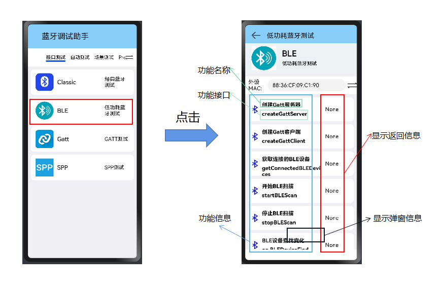
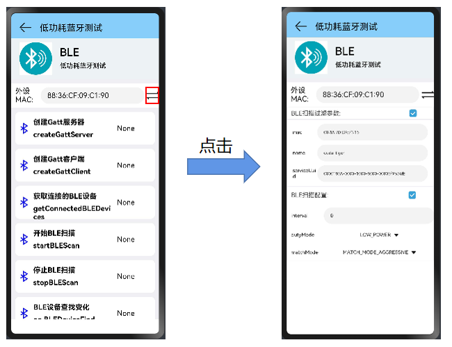

## BLE蓝牙使用说明文档

​		本文档主要介绍了蓝牙专项测试程序的BLE蓝牙部分的功能使用说明。

#### 从主界面跳转到BLE蓝牙部分

---

#### setting界面

点击"switch"按钮 ，设置本设备的BLE参数与配置。

>"BLE扫描过滤参数"，"BLE扫描配置" 默认都为true，是勾选的；值也是默认填好的。**如果不需要更改，无需打开BleFilter界面**。
>
>外设MAC地址填了默认值，可根据自己的连接需求更改。
>
>BLE扫描过滤参数包括：
>
>- 本机MAC地址。
>- 本机name。
>- 本机的serviceUUid。
>
>BLE扫描配置包括：
>
>- interval值 （默认值：0）
>
>- dutyMode：(默认值：LOW_POWER )
>
>  > - LOW_POWER
>  > - BALANCED
>  > - LOW_LATENCY
>
>- matchMode:(默认值: MATCH_MODE_AGGRESSIVE)
>
>  >- MATCH_MODE_AGGRESSIVE
>  >- MATCH_MODE_STICKY
>

#### BLE蓝牙的主要接口

|    method名称     |        API名称         |                      所需参数                       |    返回值     | 备注 |
| :---------------: | :--------------------: | :-------------------------------------------------: | :-----------: | :--: |
|    开始BLE扫描    |      startBLEScan      | (filters: Array<ScanFilter>, options?: ScanOptions) |     void      |      |
|    停止BLE扫描    |      stopBLEScan       |                         ()                          |     void      |      |
|  BLE设备查找变化  |   on. BLEDeviceFind    |     (deviceItems: Array<bluetooth.ScanResult>)      |     void      |      |
| 获取连接的BLE设备 | getConnectedBLEDevices |                         ()                          | Array<string> |      |

注：此处的"创建Gatt服务器"，"创建Gatt客户端"功能只是写了个壳子，其主要功能在Gatt界面中。

#### 功能

**"蓝牙打开"是其他功能测试的前提**

1. 开始/停止BLE扫描

   - 使用指导：

     > 开始BLE扫描：
     >
     > - 开始扫描具有筛选器的指定BLE设备。
     > - filters表示用于筛选出指定设备的筛选器列表。
     > - options指示扫描的参数，如果用户未指定值，将使用默认值。
     >
     > 停止BLE扫描。

   - 限制条件：只能扫描到指定BLE设备。

   - 验证方法：根据弹窗消息查看已扫描到的BLE

2. BLE设备查找变化

   - 使用指导：为回调函数，用来监听相关类型事件的变化，并弹窗显示信息。
     - 订阅BLE扫描结果。
     - type为要侦听的扫描结果事件的类型。
     - callback回调用于侦听扫描结果事件。
   - 限制条件：需要在相关类型事件发生改变前，开启监听。
   - 验证方法：在事件变化后，查看是否有弹窗信息显示。

3. 获取连接的BLE设备

   - 使用指导：点击后，可获取到处于连接状态的设备列表。
   - 限制条件：开始BLE扫描，并发现了可连接的设备，连接后，才可以获取此设备的相关信息。
   - 验证方法：在设备设置中，查看已经连接的设备。

   

   

